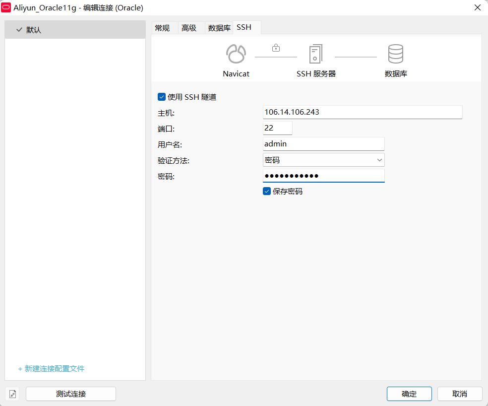
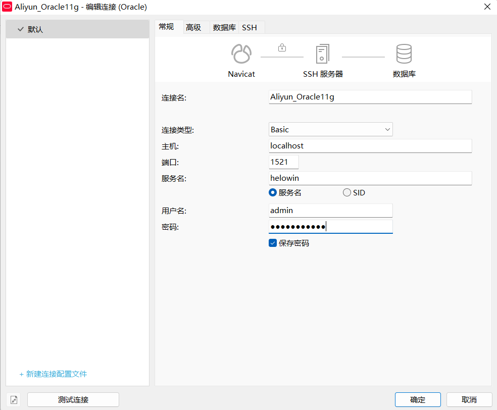

> 2022-07-16 第二次会议

### 本期任务（DDL: 07-22周五23:59）

- 由陈元哲、胡锦晖、白珂睿三人尝试开发并上线一个注册登录功能

- 其余同学根据自己的开发意向学习相关技术

### Oracle on ECS

##### 服务器端登录

首先通过ssh登录到服务器

```
ssh admin@106.14.106.243
```

输入密码即可

```
sudo docker exec -it oracle11g bash

sqlplus

```

如果提示需要配置 `ORACLE_HOME` 的环境变量，直接运行

```
source /etc/profile
```

按照提示输入用户名和密码，如果能成功登录就说明连接没有问题

ps：

- 如果需要配置本机host名称以及免密登录等功能，可以自寻ssh教程（或者问我）

- 由于服务器在上海且只有3Mbps带宽，距离较远的同学建议通过tmux完成上述任务，否则可能遇到卡顿或其他不可预知的情况

##### Navicat登录

下面是我本机跑通的过程，如果有没有必要的步骤欢迎大家指正！

首先需要配置TNS

在 [Oracle官网](https://www.oracle.com/database/technologies/instant-client/winx64-64-downloads.html) 下载Instant-Client

解压后在相应目录下，我的是 `D:\OracleInstantClient\instantclient_21_6\network\admin` 新建两个文件：

1. listener.ora

```
# listener.ora Network Configuration File: /home/oracle/app/oracle/product/11.2.0/dbhome_2/network/admin/listener.ora
# Generated by Oracle configuration tools.

LISTENER =
  (DESCRIPTION_LIST =
    (DESCRIPTION =
      (ADDRESS = (PROTOCOL = IPC)(KEY = EXTPROC1521))
      (ADDRESS = (PROTOCOL = TCP)(HOST = localhost)(PORT = 1521))  # localhost:1521
    )
  )
ADR_BASE_LISTENER = /home/oracle/app/oracle
```

2. tnsnames.ora

```
# tnsnames.ora Network Configuration File: /home/oracle/app/oracle/product/11.2.0/dbhome_2/network/admin/tnsnames.ora
# Generated by Oracle configuration tools.

LISTENER_HELOWIN =
  (ADDRESS = (PROTOCOL = TCP)(HOST = loaclhost)(PORT = 1521))

HELOWIN =
  (DESCRIPTION =
    (ADDRESS = (PROTOCOL = TCP)(HOST = localhost)(PORT = 1521))
    (CONNECT_DATA =
      (SERVER = DEDICATED)
      (SERVICE_NAME = helowin)  
    )
  )
```

*插播一句，我个人觉得在Navicat12以上版本以上步骤其实是不需要的，因为我们使用Navicat自带的OCI环境*

之后打开Navicat，新建连接

首先配置SSH



之后配置数据库连接



具体步骤还可以参考会议录屏

即可完成连接！

如果不行可以将Navicat的OCI环境改成我们前面配的那个再试试